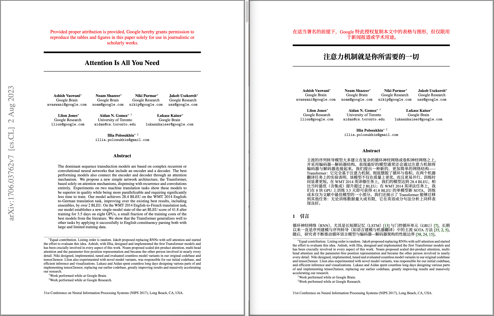
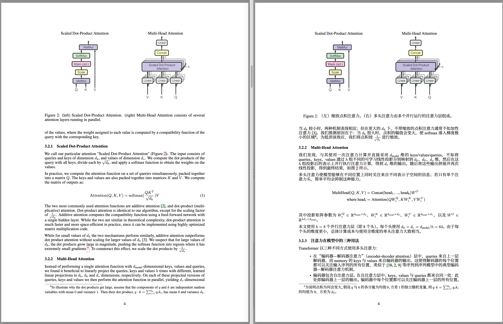
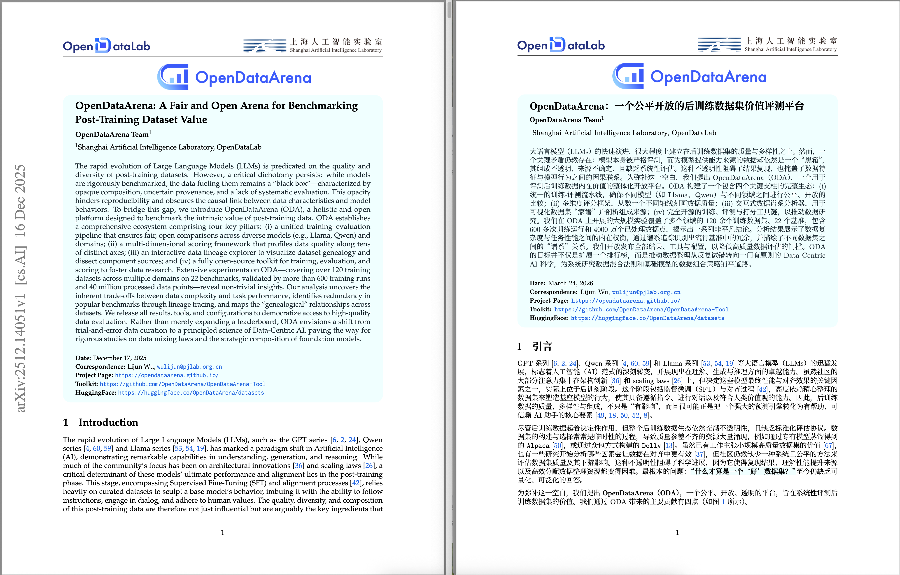

## 为什么开发 arXiv-translator Skill 🤔

新论文层出不穷，英文读得再顺也不如母语省心；我们想把这些论文变成排版规范、读着顺口的中文 PDF。

依托 CS 领域最常用的 arXiv 平台，我们编写了一个从 LaTeX 源码进行翻译并编译的 Skill，可在一键安装 Skill 后，直接告诉它想读什么论文，几分钟后，一篇排版清晰、语言易读的论文便呈现在你面前。

> *本Skill采用中文进行开发，目的是为了进一步降低阅读门槛，同时也借这个例子说明：网上常被提到的 Skill，拆开来看并不神秘，本质上是把领域流程、约束和工具调用方式写进一份结构化说明里，相当于 Prompt 与工作流的整合与进阶，而非黑盒魔法。*


## 这个 Skill 是做什么的？ 🔧 

在支持 Agent Skills 的环境里（例如 Codex、Claude Code、Cursor 等），安装本 Skill 后，你可以直接说明意图，例如：

- 「帮我把 1706.03762 翻译成中文 PDF」/「翻译这篇 arXiv：https://arxiv.org/abs/…」
- 「Limo: Less is more for reasoning 有中文版吗？给我翻译一版」/「我想读 xxx 这篇的中文版」
- 多篇时可说：「翻译 2501.12948 和 Attention Is All You Need」

核心是：给出能唯一定位论文的信息（ID、arXiv 链接或论文标题），并传达出翻译的目的；Agent 会自动基于本 Skill 里的步骤执行。

> 注：为节省 token 与处理时间，默认仅翻译正文部分；若需要全文翻译，请告知模型「翻译全文，包含附录」。

Skill 会引导 Agent：

1. 拉取 arXiv LaTeX；无源码则说明并跳过。
2. 翻译正文，公式、引用、标签、图表路径与常用学术英文词保留不译。
3. 主文件 `\begin{document}` 前插入编译所需库与中文支持。
4. `scripts/compile.py` 提交在线 LuaLaTeX 编译，生成 PDF。

本地仅需：Python 3 与 `requests`（`pip install requests`）。无需在本地配置任何 LaTeX 编译环境。


## 安装方式 💻 

安装方式千千万，这里推荐最稳妥、对网络和权限要求最低的安装流程。

1. Clone 本仓库：

   ```bash
   git clone https://github.com/Leey21/arxiv-translator
   ```

   注：若 Git 不可用，可直接下载压缩包解压。

2. 打开你常用的 CLI / IDE Agent 对话，发送：

   ```text
   路径 `<path>` 中定义了一个 Skill，请你阅读并将其安装到你的 skills 目录下。
   ```
   
   注：将 `<path>` 替换为你克隆后的项目路径，即本仓库里 `arxiv-translator` 目录的绝对路径。

以Codex为例，安装过程如下：


英文原版与中文译文的 PDF 页面对比，版式与公式结构保持一致，非必要内容不进行翻译，实现了对学术专有名词的保留，同时适配各种不同的论文模板：




## 和「直接把 PDF 丢给翻译」相比，优势在哪里？ 📊

| 维度 | 直接翻译 PDF | 本 Skill（LaTeX 源码路径） |
|------|----------------|-----------------------------|
| 版面与公式 | 整页/OCR 易乱版，公式与多栏易坏 | 在源码里保留数学与引用，再编译成正常 PDF |
| 翻译粒度 | 常按页切块，和章节结构脱节 | 按标题、摘要、正文等结构译，细则见 `SKILL.md` |
| 上下文与译文质量 | 切块输入，语境窄，术语与指代易不一致 | 能利用更大上下文，论证与术语更易统一 |
| 可复核性 | 难按原结构改 | 产出 `.tex`，方便 diff 与局部重译 |
| 依赖环境 | 各家工具形态不一 | 编译走在线 HTTP API，免本地 LaTeX |

当然，本 Skill 也有限制：仅适用于 arXiv 上提供 LaTeX 源码的稿件；纯 PDF 投稿则无法沿用同一流程。

## 仓库结构 📂

```
arxiv-translator/
├── SKILL.md                 # Skill 主说明（Agent 实际读取的核心内容）
├── scripts/
│   ├── download.py          # 按 arXiv ID 下载 e-print 并解压到工作目录
│   ├── inspect_tex.py       # 扫描正文中可能未翻译的英文片段（辅助检查）
│   ├── compile.py           # 将工作目录打包提交在线编译，写出 PDF
│   └── cleanup.py           # 删除单篇论文的 .tmp_arxiv/<ID> 工作目录（该篇编译成功后调用）
└── references/
    └── compile-errors.md    # 编译失败时的排查参考
```

## 致谢 🙏

在线编译依赖 [LaTeX-On-HTTP](https://github.com/YtoTech/latex-on-http) 提供的 HTTP 编译能力。本 Skill 中的 `compile.py` 通过其公共服务 `https://latex.ytotech.com/builds/sync` 提交工程，由服务端完成 LuaLaTeX 编译，省去了在本地安装与维护完整 LaTeX 环境的成本。若你在科研或工作中受益，也欢迎去了解、反馈或参与该上游项目。

---

如有问题或改进建议，欢迎在 Issues 中讨论 💬
